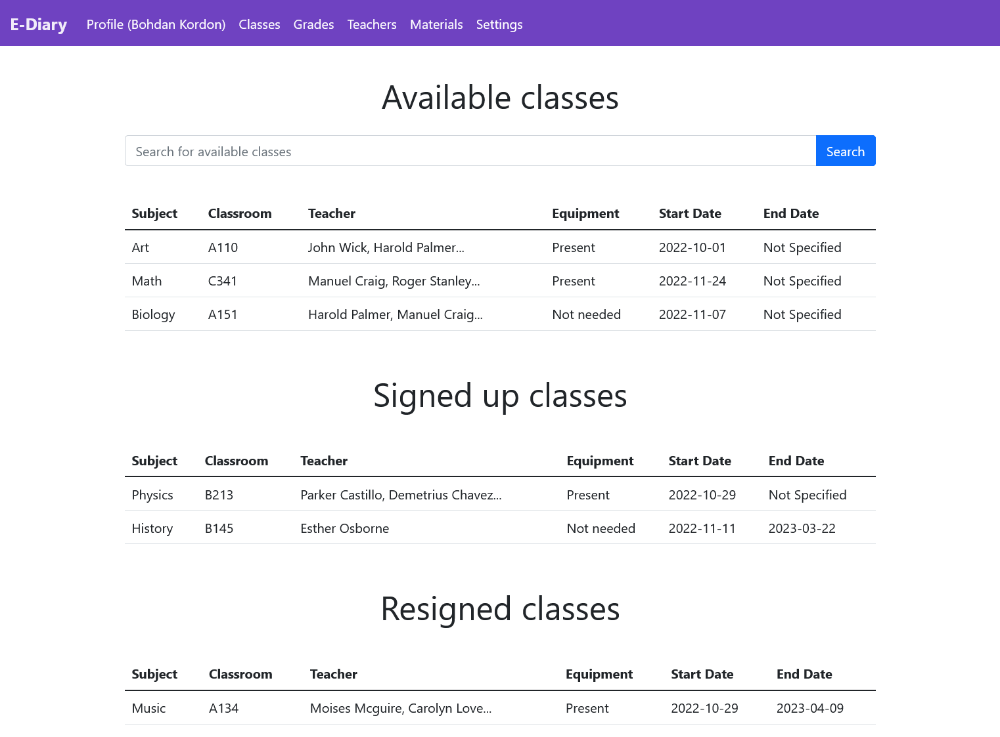

# E-Diary Project for MAS subject (PJATK)

## Description
The designed system should allow students to sign up for available classes that are accessible for them. Students will have a possibility to firstly look through a list of available classes and then choose the desired one. Also they have a possibility to look through classes that are active / resigned.

## Technologies
- Java
- Hibernate (ORM)
- H2 Database
- Spring
- Thymeleaf
- Lombok
- Bootstrap
- Maven